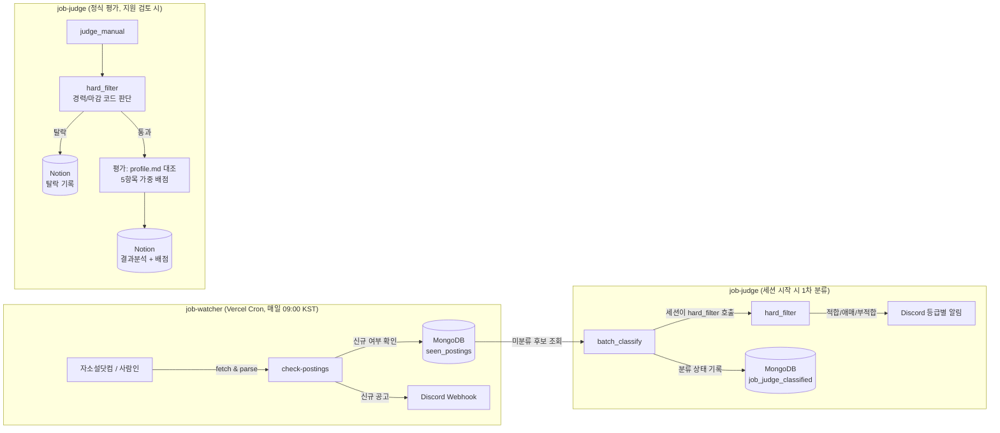

# 🎯 job-fit-matcher: 채용공고 자동 발견 & 지원적합도 평가 파이프라인

## 🌟 프로젝트 소개
매일 여러 채용 사이트를 직접 훑어보고, 공고마다 자격요건을 대조하고, 판단 기준이 매번 오락가락하는 문제를 해결하기 위해 만든 **개인용 채용 트래킹 자동화 시스템**입니다.

`job-watcher`(신규 공고 발견)와 `job-judge`(하드필터 + 정성평가)라는 완전히 독립적인 두 서비스로 구성되어 있습니다. `job-judge`는 유료 API 키 없이 동작하도록, 공고 정규화와 평가는 Claude Code 세션이 직접 수행하고 코드는 하드필터·점수 범위 검증·Notion 저장처럼 결정론적으로 처리할 수 있는 부분만 맡습니다. 평가 기준은 지침 문서로 고정하고, 반드시 지켜야 하는 규칙은 코드로 강제했습니다.

<br>

## 🛠 Tech Stack
- **job-watcher** (신규 공고 발견): TypeScript, Vercel Serverless Functions, Vercel Cron
- **job-judge** (하드필터 + 정성평가): Python 3, Pydantic, Typer (평가는 Claude Code 세션이 수행하고, Anthropic SDK 호출 경로는 API 키를 쓸 때를 위한 대체 경로)
- **Storage:** MongoDB Atlas (공고 상태 추적), Notion API (결과 트래커)
- **Notification:** Discord Webhook / Embeds
- **Test:** pytest (149 tests), vitest (36 tests) — 전부 mock 기반

<br>

## 📌 아키텍처 흐름


1. **발견 (job-watcher):** Vercel Cron이 매일 자소설닷컴·사람인을 파싱해 신규 공고만 MongoDB로 중복 제거 후 Discord로 알림 (LLM 호출 없이 전부 결정론적 코드)
2. **1차 분류 (job-judge, 세션 시작 훅):** 쌓인 신규 공고를 Claude Code 세션이 `hard_filter`를 호출해 먼저 거르고, 나머지만 `profile.md`와 가볍게 대조해 적합/애매/부적합 3단계로 재정리
3. **정식 평가 (job-judge, 지원 검토 시):** 하드필터를 통과한 공고만 5개 항목(필수요건/기술스택/업무내용/우대사항/도메인) 가중 배점으로 정성평가하고, 근거(evidence)를 Notion 페이지 본문에 기록

<br>

## 🔥 주요 설계 / 트러블슈팅

- **하드필터 → 세션 평가 2단계 분리**
  - 경력 연차·마감일처럼 코드로 명확히 판단 가능한 조건은 정규식 기반 `hard_filter`가 먼저 걸러내고, 탈락 공고는 Claude Code 세션의 평가 단계로 아예 넘어가지 않도록 설계해 세션의 토큰 사용을 줄임
  - "신입 또는 경력 3년 이상" 같은 대체경로, "경력 3년 이상, 금융권 경험 우대"처럼 절(clause) 단위로 우대/필수를 구분하는 등 오탈락을 막는 예외 처리를 정규식+휴리스틱으로 구현

- **점수 선택지를 5단계 고정값으로 좁히고 계산 근거 기록**
  - 초기엔 배점만 있고 채점 규칙이 없어 LLM이 21점, 23점처럼 점수를 자유롭게 매겼고, 그 점수가 어떤 근거에서 나왔는지 되짚기 어려웠음
  - 근거 수준을 5단계(직접 충족 100% / 범위 일부 부족 75% / 유사 경험 50% / 기초 수준 25% / 미충족 0%)로 지침에 고정하고, 카테고리 내 여러 요구사항은 "핵심/필수" 가중치 2배를 적용한 가중평균 후 마지막 한 번만 반올림하도록 정함. 항목별 계산 근거(`score_breakdown`)를 남겨 점수를 다시 검토할 수 있게 함
  - 코드는 점수 항목 5개와 각 배점 상한을 검증하고, 필수요건 점수가 낮은데 "적극 지원"이면 결과에 경고를 붙임

- **소스 간 중복 제거 (자소설닷컴 ↔ 사람인 ↔ Notion)**
  - 같은 회사가 여러 채용 사이트에 각각 공고를 올리거나, 이미 Notion에 등록된 회사가 다른 URL로 다시 감지되는 문제를 회사명 정규화(법인 형태 접두/접미어 제거) 비교로 해결
  - 단, 같은 회사라도 제목에 구체적 직무/부문명이 있으면 서로 다른 공고로 판단해 중복 제거 대상에서 제외 — 그룹 통합 공고와 계열사별 개별 공고를 구분

- **캐시 친화적 단일 진실 소스(`profile.md`) 설계**
  - 매 평가마다 프롬프트에 통째로 들어가는 프로필 파일을 "정보 밀도 높은 불릿 + 키워드 태그" 형태로 유지해 토큰 비용을 관리
  - 자기소개서 문항이 들어오면 이 파일에서 키워드로 즉시 관련 경험을 찾을 수 있도록 설계

- **Notion 데이터소스 API 마이그레이션 대응**
  - Notion API의 `databases.query` 폐지(2025-09+) 이후 구조인 `data_sources.query`로 전환하고, URL 컬럼도 rich_text + 하이퍼링크 방식으로 변경된 스펙에 맞춰 중복 탐지 로직을 재구현

<br>

## 💭 회고 및 배운 점

- **"명확한 규칙"도 실제 문장 앞에서는 계속 깨졌다.**
  하드필터는 "경력 연차·마감일만 보는 단순 규칙"으로 시작했지만, 실제 채용공고 문장은 예외투성이였다. "신입 또는 경력 3년 이상"(대체경로 인정), "경력 3년 이상, 금융권 경험 우대"(우대는 뒤 절에만 적용), "경력 3년 이상 (신입 지원 불가)"(신입이라는 글자만 보고 오판하면 안 되는 부정 표현) — 처음엔 다 놓쳤던 케이스들이다. 규칙 기반 로직일수록 "명확해 보인다"는 확신을 경계하고, 실제 데이터로 깨뜨려보는 과정이 꼭 필요하다는 걸 반복해서 확인했다.

- **점수는 자유도를 주는 순간 근거를 되짚기 어려워진다.**
  처음엔 LLM이 21점, 23점처럼 자유롭게 매기게 했는데, 점수가 왜 그 값인지 다시 따져 보기 어려웠다. "정성 판단을 아예 없앤다"가 아니라 "판단은 5단계 고정값 중에서만 고르고, 왜 그 단계인지 한 줄 근거와 계산식을 남긴다"로 바꿨다 — 자유도를 통째로 없애는 대신 **판단의 폭을 정해진 선택지로 좁히는 것**이 검토 가능성과 정성적 판단을 동시에 지키는 절충점이었다. 5단계 선택은 지침으로 고정했고, 점수 범위와 필수요건 경고처럼 반드시 지킬 규칙은 코드로 강제했다.

- **테스트 통과가 곧 실제 동작 확인은 아니었다.**
  pytest는 전부 통과했지만, 실제로 콘솔에서 한 번 돌려보니 Windows 콘솔 인코딩(cp949) 때문에 em dash 하나로 죽는 버그가 있었다. `CliRunner`의 출력 캡처 방식이 실제 콘솔 실행과 달라서 테스트가 숨겨버린 것 — mock 기반 테스트와 실제 실행은 서로 다른 걸 검증한다는 걸 몸으로 배웠다. 이후로는 코드를 고칠 때마다 최소 한 번은 진짜 실행까지 확인하는 습관이 붙었다.

- **의존 라이브러리는 문서/기억보다 최신일 수 있다.**
  Notion API 연동 코드는 스펙 문서를 보고 짰지만, 설치된 SDK가 이미 `databases.query`를 없애고 `data_sources` 구조로 마이그레이션한 뒤였다. import가 되고 메서드가 존재한다고 해서 API 형태가 맞다는 보장은 아니었다 — 실제 서비스에 한 번 호출해보고 나서야 발견한 문제였다.

- **규모에 안 맞는 설계는 "거절하는 것"도 설계 판단이다.**
  외부 피드백에서 rubric 버전 관리, 해시 기반 재현성 인프라, 통계적 가중치 검증 같은 정교한 구조를 제안받았지만, 혼자 쓰는 도구에는 유지비가 이득보다 크다고 판단해 채택하지 않았다. 대신 실제로 검증된 버그만 가볍게 고치는 쪽을 택했다 — 좋은 제안을 무조건 반영하기보다, 이 프로젝트의 실제 규모와 용도에 맞는지 먼저 따지는 판단이 더 중요했다.

- **역할 분담은 처음부터 구조에 넣어야 한다.**
  "코드로 판단 가능한 건 코드가, 정말 판단이 필요한 것만 Claude Code 세션이" 라는 원칙을 하드필터/1차 분류/정식 평가 세 단계 전체에 일관되게 적용한 덕분에, 유료 API 없이도 세션의 판단이 꼭 필요한 곳에만 집중됐다. 비용 절감은 나중에 끼워 넣는 게 아니라 파이프라인을 나누는 단계에서부터 설계에 포함되어야 효과가 크다는 걸 이 프로젝트를 포함한 여러 프로젝트에서 공통적으로 느꼈다.

<br>

## 📚 개발 기록
- [개발 기록](docs/개발기록.md) — 날짜별 타임라인, AI 에이전트 하네스 설계, 운영 중 발견한 문제와 대응
- [평가기준 개선 전체기록](docs/260919_평가기준_개선_전체기록.md) — 채점 기준 v1 → v1.3의 원인·개선·결과
- [ChatGPT·Claude 교차 검토 논의기록](docs/260919_평가기준_개선_ChatGPT_Claude_논의기록.md) — 같은 개선 과정을 검토자(ChatGPT) 시점에서 정리: 제안·반론·수용/미채택 이유
- [개발 청사진](docs/채용공고_분석시스템_개발청사진.md) — 처음 에이전트에게 넘긴 설계 문서

<br>

## ✅ 테스트
```bash
cd job-judge && python -m pytest -v   # 149개, 전부 mock 기반이라 실제 API 키 불필요
cd job-watcher && npm test            # vitest, 네트워크/DB/Discord 전부 mock
```
